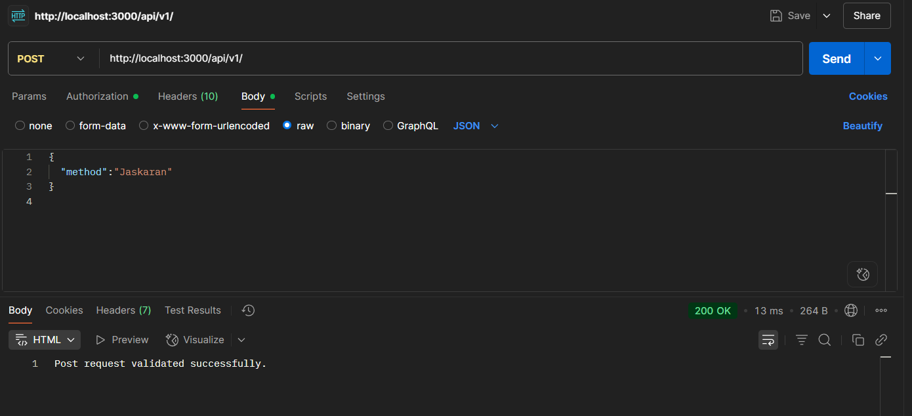
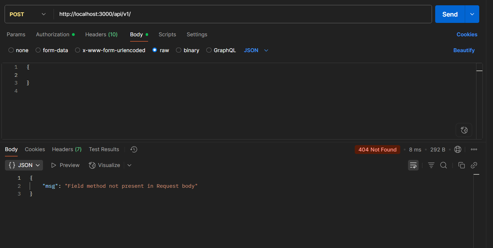
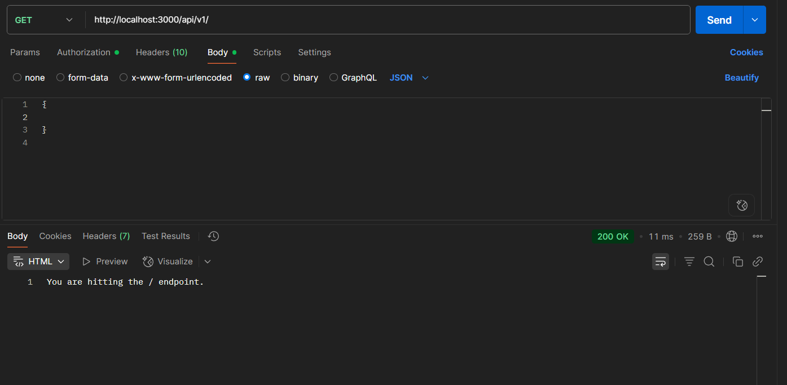

# Simple API Server

### Assignment for week 4 submitted by Jaskaran Singh: singh.jaskaran2024@gmail.com

This project provides two API endpoints for demonstration/testing purposes: a **GET** endpoint and a **POST** endpoint with middleware validation.

---

## 🛠️ Setup

1. Clone the repository:
   ```bash
   git clone https://github.com/your-username/your-repo-name.git
   cd your-repo-name
   ```

npm install

npx nodemon src/index.js

API Endpoints
All routes are prefixed with /api/v1.

✅ GET /api/v1
Purpose: Health check endpoint.

URL: http://localhost:3000/api/v1

Method: GET

Response:

json
Copy
Edit
{
"message": "API is working!"
}
✅ POST /api/v1/
Purpose: Accepts a JSON payload with a required method field.

URL: http://localhost:3000/api/v1/

Method: POST

Headers:

Content-Type: application/json

Required Request Body:

json
Copy
Edit
{
"method": "exampleValue"
}
✅ Example Success Response:
json
Copy
Edit
{
"status": "success",
"receivedMethod": "exampleValue"
}
❌ Example Error Response (Missing "method"):
json
Copy
Edit
{
"error": "Request body must include a 'method' field"
}
🧪 Test with cURL
GET Request

bash
Copy
Edit
curl http://localhost:3000/api/v1
POST Request (valid)

bash
Copy
Edit
curl -X POST http://localhost:3000/api/v1/
-H "Content-Type: application/json" \
 -d '{"method": "test"}'
POST Request (invalid)

bash
Copy
Edit
curl -X POST http://localhost:3000/api/v1/
-H "Content-Type: application/json"
-d '{}'

🧰 Middleware
The POST /api/v1/ route uses middleware to ensure the request body contains a method key. If it is missing, the middleware responds with an error and halts execution.

✅ Summary of Routes
Method Endpoint Description
GET /api/v1
POST /api/v1/ Requires "method" in body

### Screenshots:

### 1. POST REQUEST





### 2. GET REQUEST


